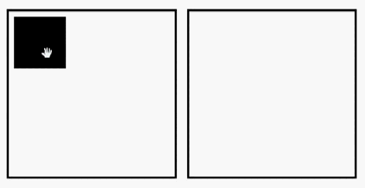

# CSS-DnD

## 

### jQuery plugin for making droppable/draggable items just adding CSS classes

## Table of topics
1. [How to use it?](#use)
1. [Description](#description)
1. [Example](#example)
1. [New versions of this tool](#changelog)
1. [Further help](#help)

## Description

This project use the native Drag & Drop function of the browser. Just adding some CSS classes to the element this plugin do the rest.

<h2 id="use">Use steps</h2>

First need to install the package from NPM

> ### `npm i -S css-dnd`

Then import it within the BODY tag

```html
<body>
    ...
    <script src="./node_modules/css-dnd/dist/css-dnd.min.js"></script>
</body>
```

> ### Do not forget to import jQuery before this !!

Once you have done all the importation steps, you need to add the class to the elements

```html
<body>
    ...
    <div class="dnd-droppable">
        <div class="dnd-draggable"></div>
    </div> 
    <div class="dnd-droppable"></div>    
</body>
```

> If you want the default styles just add the css file within the HEAD tag

```html
<head>
    ...
    <link rel="stylesheet" href="./node_modules/css-dnd/dist/css-dnd.min.css">
</head>
```

<h2 id="example">Example with default styles </h2>

## 

> You can style it at your own way just using the provided classes 

## Changelog

Get update with all new versions [here](https://github.com/2rhop/css-dnd/releases)

## Licence
Copyright (c) 2019 Rene Ricardo. Licensed under the [MIT](https://github.com/2rhop/css-dnd/blob/master/LICENSE) license.

## Help

Send me an [email](mailto:renerp2016@gmail.com) if you have some doubt or just add an [issue](https://github.com/2rhop/css-dnd/issues)